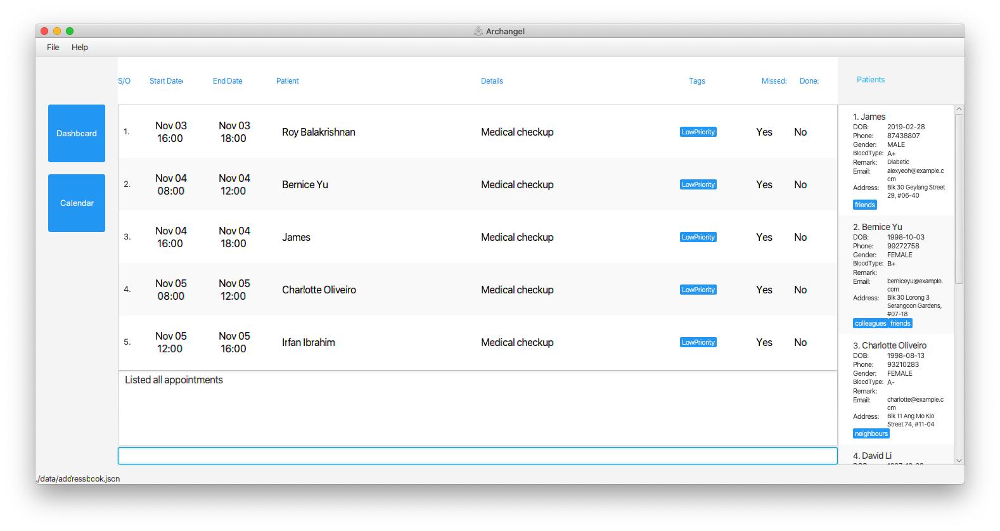
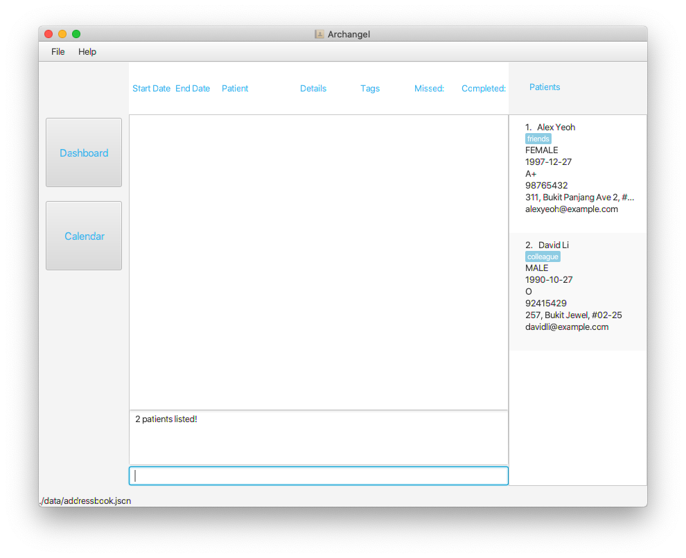

Archangel is a desktop app for managing patient appointments, optimized for use via a Command Line Interface (CLI) while still having the benefits of a Graphical User Interface (GUI).
If you can type fast, Archangel can get your patient management appointment done faster than traditional GUI apps.

* Table of Contents
{:toc}

--------------------------------------------------------------------------------------------------------------------

## Quick start

1. Ensure you have Java 11 or above installed in your Computer.

2. Download the latest addressbook.jar from [here](https://github.com/se-edu/addressbook-level3/releases).

3. Copy the file to the folder you want to use as the _home folder_ for your AddressBook.

4. Double-click the file to start the app. The GUI similar to the below should appear in a few seconds. Note how the app contains some sample data. 
   

5. Type the command in the command box and press Enter to execute it. e.g. typing `help` and pressing Enter will open the help window. 
   Some example commands you can try:

   * `p-list` : Lists all patients.

   * **`p-add`**`n/John Doe g/MALE bd/2018-12-27 bt/A+ p/98765432 e/johnd@example.com a/311, Clementi Ave 2, #02-25` : Adds a Patient named John Doe to the Archangel.

   * **`p-delete`**`3` : Deletes the 3rd patient shown in the current list.

   * `exit` : Exits the app.

6. Refer to the [Features](#features) below for details of each command.

--------------------------------------------------------------------------------------------------------------------

## Features

**:information_source: Notes about the command format:** 

* Commands are identified by their quantifier type leading the actual command formatted as `{TYPE}-{COMMAND}`.
  * `p-{COMMAND}` - commands that acts on Patient-type data.
  * `a-{COMMAND}` - commands that acts on Appointment-type data.
    e.g. `p-delete` deletes a patient, `a-delete` deletes an appointment.

* Words in UPPER_CASE are the parameters to be supplied by the user. 
  e.g. in `p-add n/NAME`, `NAME` is a parameter which can be used as `p-add n/John Doe`.

* Items in square brackets are optional. 
  e.g `n/NAME [t/TAG]` can be used as `n/John Doe t/friend` or as `n/John Doe`.

* Items with `…`​ after them can be used multiple times including zero times. 
  e.g. `[t/TAG]…​` can be used as   (i.e. 0 times), `t/friend`, `t/friend t/family` etc.

* Parameters can be in any order. 
  e.g. if the command specifies `n/NAME p/PHONE_NUMBER`, `p/PHONE_NUMBER n/NAME` is also acceptable.

### Viewing help : help

Shows a message explaining how to access the help page.

Format: `help`

### 1. Adding a patient: `p-add`

Adds a patient to the address book.
Format: `p-add n/NAME g/GENDER bd/BIRTHDATE bt/BLOODTYPE p/PHONE_NUMBER e/EMAIL a/ADDRESS [t/TAG]…`​

* BIRTHDATE should be in YYYY/MM/DD format.

:bulb: Tip:
A patient can have any number of tags (including 0)

Examples:
* `p-add n/John Doe p/98765432 e/johnd@example.com a/John street, block 123, #01-01`
* `p-add n/Betsy Crowe t/friend e/betsycrowe@example.com a/Newgate Prison p/1234567 t/criminal`

### 2. View a patient's information: `p-view`

View the patient's information stored in Archangel.

Format: `p-view n/NAME`
* View the patient with the specified name

### 3. Listing all patients : `p-list`

Shows a list of all patients in the address book.

Format: `p-list`

### 4. Editing a patient : `p-edit`

Edits an existing patient in the address book.

Format: `p-edit INDEX [n/NAME] [g/GENDER] [bd/BIRTHDATE] [bt/BLOODTYPE] [p/PHONE] [e/EMAIL] [a/ADDRESS] [t/TAG]…​`

* Edits the patient at the specified INDEX. The index refers to the index number shown in the displayed patient list. The index must be a positive integer 1, 2, 3, …​
* At least one of the optional fields must be provided.
* Existing values will be updated to the input values.
* When editing tags, the existing tags of the patient will be removed i.e adding of tags is not cumulative.
* You can remove all the patient’s tags by typing `t/` without specifying any tags after it.

Examples:
* `p-edit 1 p/91234567 e/johndoe@example.com` Edits the phone number and email address of the 1st patient to be 91234567 and johndoe@example.com respectively.
* `p-edit 2 n/Betsy Crower t/` Edits the name of the 2nd patient to be Betsy Crower and clears all existing tags.

### Locating patients by name: `p-find`

Finds patients whose names contain any of the given keywords.

Format: `p-find KEYWORD [MORE_KEYWORDS]`

* The search is case-insensitive. e.g `hans` will match `Hans`
* The order of the keywords does not matter. e.g. `Hans Bo` will match `Bo Hans`
* Only the name is searched.
* Only full words will be matched e.g. `Han` will not match `Hans`
* Persons matching at least one keyword will be returned (i.e. OR search).
  e.g. `Hans Bo` will return `Hans Gruber`, `Bo Yang`

Examples:
* `p-find John` returns `john` and `John Doe`
* `p-find alex david` returns `Alex Yeoh`, `David Li` 
  

### 5. Giving a patient a Remark : `p-remark`

Stores a remark under the patient's information.

Format: `p-remark INDEX r/REMARK`

* Store a remark for the patient at the specified INDEX.
* The index refers to the index number shown in the displayed patient list.
* The index must be a positive integer 1, 2, 3, …​

Examples:
* `p-remark 1 r/ Likes to swim.` gives the 1st patient in the list a remark of `Likes to swim.`

### 6. Removing a patient's Remark : `p-remark`

Stores a remark under the patient's information.

Format: `p-remark INDEX`

* Removes the remark for the patient at the specified INDEX.
* The index refers to the index number shown in the displayed patient list.
* The index must be a positive integer 1, 2, 3, …​

Examples:
* `p-remark 1` removes the Remark of the 1st patient on the list.

### 7. Deleting a patient : `p-delete`

Deletes the specified patient from the Archangel.

Format: `p-delete INDEX`

* Deletes the patient at the specified INDEX.
* The index refers to the index number shown in the displayed patient list.
* The index must be a positive integer 1, 2, 3, …​

Examples:
* `p-list` followed by `p-delete 2` deletes the 2nd patient in the Archangel.
* `p-find Betsy` followed by `p-delete 1` deletes the 1st patient in the results of the find command.

### 7. Exiting the program : `exit`

Exits the program.

Format: `exit`

### 8. Saving the data

The Archangel data is saved in the hard disk automatically after any command that changes the data. There is no need to save manually.

## Coming soon in v1.2

### 1. Schedule an appointment : `a-schedule`

Schedules a new patient appointment in Archangel.

Format: `a-schedule i/INDEXOFPATIENT s/DATE&TIME e/DATE&TIME [desc/DESCRIPTION] [t/TAGS]`

* Schedules patient appointment for patient NAME.
* Optional DESCRIPTION for appointment.
* Appointment will be set to input DATE (format: YYYY-MM-DD) and TIME (format: HH-MM).

Examples:
* `a-schedule n/Kim Guan d/2020-09-14 t/08-00 desc/Review Appointment` schedules an appointment for patient Kim Guan on 2020-09-14 at 08-00 with appointment description Review Appointment.
* `a-schedule n/Kim Guan d/2020-09-14 t/08-00` schedules an appointment for patient Kim Guan on 2020-09-14 at 08-00 with no appointment description.

### 2. List all appointments : `a-list`

### 3. Delete an appointment : `a-delete`

### 4. Find an appointment : `a-find`

### 5. Edit an appointment : `a-edit`

--------------------------------------------------------------------------------------------------------------------

## FAQ

Q: How do I transfer my data to another Computer? 
A: Install the app in the other computer and overwrite the empty data file it creates with the file that contains the data of your previous AddressBook home folder.

--------------------------------------------------------------------------------------------------------------------

## Command summary

Action         | Format, Examples
---------------|------------------
Add Patient    | `p-add n/NAME p/PHONE_NUMBER e/EMAIL a/ADDRESS [t/TAG]…`​   e.g. `p-add n/James Ho p/22224444 e/jamesho@example.com a/123, Clementi Rd, 1234665 t/friend t/colleague`
View Patient   | `p-view n/NAME`  e.g. `p-view n/Kim Guan`
Delete Patient | `p-delete INDEX`  e.g. `p-delete 3`
Edit Patient   | `p-edit INDEX [n/NAME] [p/PHONE_NUMBER] [e/EMAIL] [a/ADDRESS] [t/TAG]…​`   e.g. `p-edit 2 n/James Lee e/jameslee@example.com`
Find Patient   | `p-find KEYWORD [MORE_KEYWORDS]`   e.g. `p-find James Jake`
List Patients  | `p-list`
Help           | `help`
